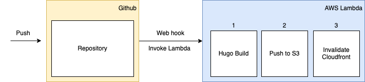

## Hugo Builder S3

Sets up a docker image to pull a git repository containing a Hugo Blog repository, build the contents and upload to S3. This is used in automating the deployment of static content to S3.

The docker image can deployed on an AWS Lambda (there is Python endpoint `main.py` to initiate the hugo builder script `script.sh`). A webhook can then trigger the pull, build and upload to S3.


### Build

Build image with a number of arguements:

```
docker build -t hugoS3 --build-arg S3BucketName=$S3BucketName --build-arg GitUrl=$Giturl --build-arg ProjectName=$ProjectName SSH_PRIVATE_KEY="$(cat /path/to/key)" --build-arg SSH_KNOWN_HOSTS="$(cat /path/to/known_hosts)" .;
```

Run locally or push to ECR and use within an AWS Lambda

### Creative Commons Zero License.

You can copy, modify, distribute and perform the work, even for commercial purposes, all without asking permission. See License.md for more details.
